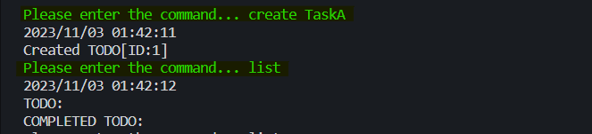
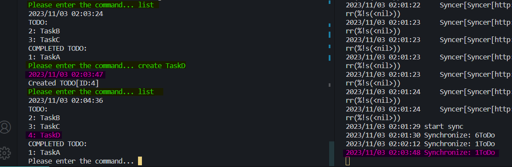

# 実行結果

CLI で実際に同期を試します。

## 前提

- データノードは 2 台あり、**1 つのコマンドはどちらか 1 つのデータノードに対して実行される**。
- そのため、**データの一貫性を保持するための機構**が必要であり、それが今回**同期機構**と呼んでいるものになる。
-

## Step.1

Step.1 では同期機構は存在せず、CLI コマンドはどちらか一方にのみ実行されるのみ。



画像のように、作成したデータが表示されない。

- ※`create`(作成)したときデータはデータノード 1 台目に保存され、次に`list`(一覧取得)してもデータノード 2 台目にデータを見に行くため、作成分のデータを参照できない。（このあと再び`list`すると 1 台目を参照するので作成分を見ることができる。）

ここから同期機構を作成することになる。

## Step.2

Step.1 時点ではデータの一貫性を保つことができなかった。

Step.2 では同期機構の実装を加えた。

### 変更点

同期機構の実装に加えてデータノードにも修正が必要だった。

#### データノードの追加実装

1. 各データノードは操作があるたびにキーバリューストアに一意のバージョンを振っていく。
2. 同期機構からの同期内容をキーバリューストアに反映する機能。

同期機構が変更内容を把握するために、データノードでバージョンを管理する必要が出てくる。

また同期機構がリクエストするためのエンドポイントを作成した。

##### データノードのバージョンの振り方例

- create, update, delete すると、バリュー（ToDo）に 1, 2, 3..と追加する。
- ※1 つのバリューについての連番ではなく、キーバリューストア全体で一つのバージョンをカウントアップする。

0.`初期状態`

```md
<!-- datanode -->
- (empty)
```

1.cli: `create TaskA`

```md
<!-- datanode -->
- ID:1, Version:1 TaskA, no-complete
```

2.cli: `create TaskB`

```md
<!-- datanode -->
- ID:1, Version:1 TaskA, no-complete
- ID:2, Version:2 TaskB, no-complete
```

3.cli: `update 1 complete`

```md
<!-- datanode -->
- ID:1, Version:3 TaskA, completed
- ID:2, Version:2 TaskB, no-complete
```

#### 同期機構の実装

同期機構の動作は主に 2 つ。

1. 同期するバージョン以上のデータを各データノードから取得。
2. 取得されたデータ(差分)を、各データノードに渡して同期する。

また、差分データは**同期機構が**管理するバージョンを付与して、それをデータノードで管理しているバージョンに上書きする。

##### 同期機構とデータノードの動作例

便宜的に 2 つのデータノードを A,B と書きます。

0.`初期状態`

```md
<!-- DatanodeA -->
- ID:1, Version:3 TaskA, completed
- ID:2, Version:2 TaskB, no-complete
<!-- DatanodeB -->
- (empty)
```

1.sync: `Get differences from version 1 onwards`

```md
<!-- in sync machine -->
- ID:1, Version:3 TaskA, completed
- ID:2, Version:2 TaskB, no-complete
```

2.sync: `Stamps the sync machine version and sends it to all data nodes`

```md
<!-- in sync machine -->
- ID:1, Version:1 TaskA, completed
- ID:2, Version:1 TaskB, no-complete

<!-- and send to datanodes -->
```

3.`Datanodes that accepted synchronization`

```md
<!-- DatanodeA -->
- ID:1, Version:1 TaskA, completed
- ID:2, Version:1 TaskB, no-complete
<!-- DatanodeB -->
- ID:1, Version:1 TaskA, completed
- ID:2, Version:1 TaskB, no-complete
```

4.cli: `create TaskC`

```md
<!-- DatanodeA -->
- ID:1, Version:1 TaskA, completed
- ID:2, Version:1 TaskB, no-complete
<!-- DatanodeB -->
- ID:1, Version:1 TaskA, completed
- ID:2, Version:1 TaskB, no-complete
- ID:3, Version:2 TaskC, no-complete
```

### 実行結果詳細

終了時点で同期機構によってデータの同期ができるようになる。



左が CLI アプリケーションのコマンド、右が同期機構のログ。
緑がコマンド。

- `create`の後にデータを参照`list`できいて、
- 右側`02:04:36 create`の直後に、左側で`02:03:48`に同期されていることが分かる。

## Step.3

step.2 では同期機構が動作してデータノード間の一貫性が一定程度保持されました。

step.3 では、同期時に発生しうる競合について焦点をあて解決していく。

### 競合発生ポイント

ここでの競合とは同期実行時に同じデータに矛盾するデータ更新が存在することを指す。

このシステムでは競合を解決するために最終更新日時を使い、競合が発生しうるポイントでは**常に競合が発生した場合は最新のデータに上書き**をする方針を取る。

#### Point1. 差分調査時

競合発生のポイントの一つ目は、同期機構が差分を取得したタイミングで発生（発覚）するもの。

1.``初期状態``

```md
<!-- DatanodeA -->
- ID:1, Version:1 TaskA, completed 00:00
DatanodeB
- ID:1, Version:1 TaskA, completed 00:00
```

2.cli(to DatanodeA): `update 1 open`

```md
<!-- DatanodeA -->
- ID:1, Version:3 TaskA, no-complete 00:01
<!-- DatanodeB -->
- ID:1, Version:1 TaskA, completed 00:00
```

3.cli(to DatanodeB): `update 1 complete`

```md
<!-- DatanodeA -->
- ID:1, Version:3 TaskA, no-complete  00:01
<!-- DatanodeB -->
- ID:1, Version:3 TaskA, completed   00:02
```

4.sync: `Get differences from version 1 onwards, and Stamps the sync machine version`

```md
<!-- in sync machine -->
- ID:1, Version:1 TaskA, no-complete 00:01
- ID:1, Version:1 TaskA, completed 00:02
<!-- ?? -->
```

5.`resolve conflict`

```md
<!-- in sync machine -->
- ID:1, Version:1 TaskA, completed 00:02
```

上の例の時、最後に更新された``3.``の動作を信頼し、ID:1については``completed``として扱われる。当然どちらが後かについては、ToDoデータに最終更新日時を追加することで確認する。

#### Point.2 差分同期時

競合発生の2つ目のポイントは、差分をデータノードに同期する間に発生する（発見される）もの。

これはデータノードが更新されるタイミングが、同期機構が差分を取得した後であり、かつ同期機構が差分を適用（同期）する前に起きた時に生じる。

> 上の例の続き

6.cli(to DatanodeA): `update 1 open`

```md
<!-- DatanodeA -->
- ID:1, Version:3 TaskA, no-complete 00:03
<!-- DatanodeB -->
- ID:1, Version:3 TaskA, completed 00:02
```

7.sync: `sends to all data nodes`

```md
<!-- in sync machine(reprint) -->
- ID:1, Version:1 TaskA, completed 00:02
```

8.`resolve confilict in datanodes`

```md
<!-- DatanodeA -->
- ID:1, Version:3 TaskA, no-complete 00:03
<!-- DatanodeB -->
- ID:1, Version:1 TaskA, completed 00:02
```

このときも最終更新分を信頼し、更新があったデータノードAでは同期データの上書きは行われなかった。

なお、次の同期実行で（特に変更がなければ）データノードBにデータノードAの変更が同期される。

### 実装点

このStep.3 では主に3つの変更がなされた。

1. キーバリューストアに最終更新日時の追加
2. 同期機構内の競合解決アルゴリズムを実装
3. キーバリューストア内に競合解決アルゴリズムを追加

``1.`` についてはそのままのであるがコードをこれまでの整理のためにもデータ構造を載せておく。

```Go
<!-- pkg/document/todo.go: -->
type Todo struct {
 Task      string
 Completed bool
 Version   int
 Deleted   bool
 UpdatedAt time.Time
}
```

``2.3.``については最終更新日時を比べるのみなので特に説明はしない。
